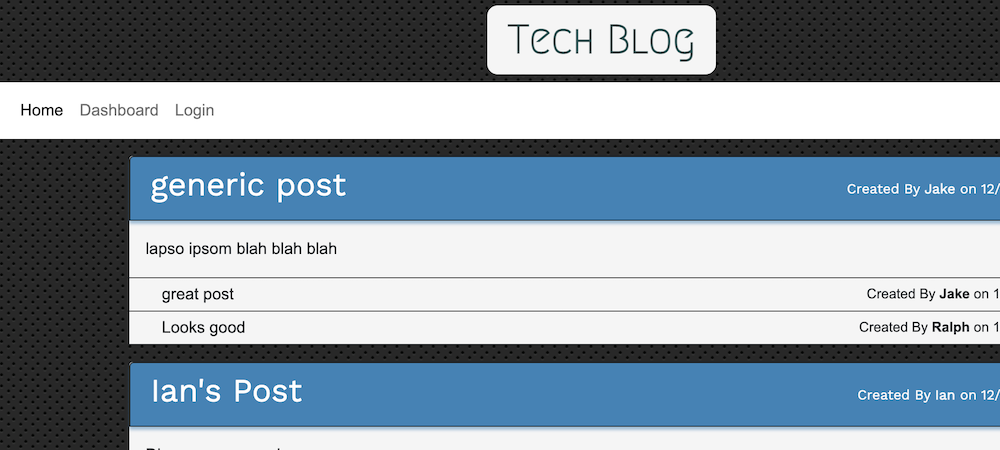

  
  
  # Tech Blog
  ## Description
Writing about tech can be just as important as making it. Developers spend plenty of time creating new applications and debugging existing codebases, but most developers also spend at least some of their time reading and writing about technical concepts, recent advancements, and new technologies. A simple Google search for any concept covered in this course returns thousands of think pieces and tutorials from developers of all skill levels!

Your task this week is to build a CMS-style blog site similar to a Wordpress site, where developers can publish their blog posts and comment on other developers’ posts as well. You’ll build this site completely from scratch and deploy it to Heroku. Your app will follow the MVC paradigm in its architectural structure, using Handlebars.js as the templating language, Sequelize as the ORM, and the express-session npm package for authentication.

## Table of Contents

- [Installation](#installation)
- [Usage](#usage)
- [Contributing](#contributing)
- [License](#license)
- [Questions](#questions)

## Installation

npm i

## Usage

npm start

## Testing

N/A

## Contributing

Open Source

## License

This project is protected under MIT License.

[License Documentation](https://opensource.org/licenses/MIT)

## Questions

[Refer to Github Profile: tallen1985](http://www.github.com/tallen1985)

Any additional questions, reach me at my email jake.allen@me.com

## Screenshot and Links

[Link to Deployed Application](https://techblog-unh-coding-bootcamp.herokuapp.com/)

[Link to Github Repo](https://github.com/tallen1985/14-Tech-Blog)

